# GlobeLoom - Class Diagram

## System Architecture Overview
GlobeLoom follows a modern full-stack architecture with React frontend, Node.js/Express backend, and MongoDB database.

## Class Diagram

```mermaid
classDiagram
    %% ===== FRONTEND CLASSES =====
    
    %% Context & State Management
    class AuthContext {
        -user: User
        -isAuthenticated: boolean
        -loading: boolean
        -error: string
        +login(credentials): Promise
        +logout(): void
        +register(userData): Promise
        +updateUser(userData): void
        +clearError(): void
    }
    
    %% Services Layer
    class ApiService {
        -baseURL: string
        -token: string
        +setToken(token): void
        +getHeaders(): object
        +request(endpoint, options): Promise
        +get(endpoint): Promise
        +post(endpoint, data): Promise
        +put(endpoint, data): Promise
        +delete(endpoint): Promise
        +register(userData): Promise
        +login(credentials): Promise
        +logout(): Promise
        +getProfile(): Promise
        +getTrips(params): Promise
        +createTrip(tripData): Promise
        +updateTrip(tripId, data): Promise
        +deleteTrip(tripId): Promise
        +getCommunityFeed(params): Promise
        +createPost(postData): Promise
        +likePost(postId): Promise
        +addComment(postId, content): Promise
    }
    
    class ServiceDiscovery {
        -knownEndpoints: string[]
        -currentEndpoint: string
        -baseURL: string
        -apiURL: string
        +discoverAvailableEndpoint(): Promise
        +isEndpointHealthy(endpoint): Promise
        +setCurrentEndpoint(endpoint): void
        +getApiURL(): string
        +makeRequest(endpoint, options): Promise
        +startHealthChecking(): void
    }
    
    %% React Components
    class LandingPage {
        +render(): JSX.Element
    }
    
    class Dashboard {
        -userTrips: Trip[]
        -loading: boolean
        -error: string
        -stats: object[]
        +fetchUserData(): Promise
        +render(): JSX.Element
    }
    
    class CreateTrip {
        -step: number
        -tripData: object
        -loading: boolean
        +nextStep(): void
        +prevStep(): void
        +createTrip(): Promise
        +render(): JSX.Element
    }
    
    class MyTrips {
        -activeTab: string
        -trips: Trip[]
        -loading: boolean
        +fetchTrips(): Promise
        +deleteTrip(tripId): Promise
        +getFilteredTrips(): Trip[]
        +render(): JSX.Element
    }
    
    class TripDetails {
        -trip: Trip
        -loading: boolean
        -isLiked: boolean
        -isBookmarked: boolean
        +fetchTrip(): Promise
        +handleLike(): Promise
        +handleBookmark(): Promise
        +render(): JSX.Element
    }
    
    class Community {
        -posts: Post[]
        -loading: boolean
        -activeFilter: string
        +fetchPosts(): Promise
        +createPost(postData): Promise
        +likePost(postId): Promise
        +addComment(postId, content): Promise
        +render(): JSX.Element
    }
    
    class Profile {
        -activeTab: string
        -loading: boolean
        -isEditing: boolean
        -formData: object
        +updateProfile(): Promise
        +uploadAvatar(file): Promise
        +render(): JSX.Element
    }
    
    %% ===== BACKEND CLASSES =====
    
    %% Controllers
    class AuthController {
        +register(req, res): Promise
        +login(req, res): Promise
        +logout(req, res): Promise
        +refreshToken(req, res): Promise
        +getProfile(req, res): Promise
        +updateProfile(req, res): Promise
    }
    
    class TripController {
        +createTrip(req, res): Promise
        +getUserTrips(req, res): Promise
        +getTripById(req, res): Promise
        +updateTrip(req, res): Promise
        +deleteTrip(req, res): Promise
        +addActivity(req, res): Promise
        +updateActivity(req, res): Promise
        +deleteActivity(req, res): Promise
        +addCollaborator(req, res): Promise
        +removeCollaborator(req, res): Promise
    }
    
    class CommunityController {
        +getFeed(req, res): Promise
        +createPost(req, res): Promise
        +getPost(req, res): Promise
        +toggleLike(req, res): Promise
        +addComment(req, res): Promise
        +sharePost(req, res): Promise
        +deletePost(req, res): Promise
        +getUserProfile(req, res): Promise
        +toggleBookmark(req, res): Promise
        +getSavedPosts(req, res): Promise
        +getTrendingTags(req, res): Promise
        +getCommunityStats(req, res): Promise
        +getSuggestedUsers(req, res): Promise
    }
    
    class UserController {
        +searchUsers(req, res): Promise
        +getUserProfile(req, res): Promise
        +followUser(req, res): Promise
        +unfollowUser(req, res): Promise
        +getFollowers(req, res): Promise
        +getFollowing(req, res): Promise
        +updatePreferences(req, res): Promise
        +getLeaderboard(req, res): Promise
        +updateProfile(req, res): Promise
    }
    
    %% Models
    class User {
        +_id: ObjectId
        +firstName: string
        +lastName: string
        +displayName: string
        +email: string
        +password: string
        +avatar: string
        +banner: string
        +bio: string
        +location: object
        +dateOfBirth: Date
        +gender: string
        +phoneNumber: string
        +isVerified: boolean
        +isActive: boolean
        +lastLoginAt: Date
        +refreshTokens: object[]
        +profile: object
        +socialConnections: object
        +gamification: object
        +followers: ObjectId[]
        +following: ObjectId[]
        +savedPosts: ObjectId[]
        +blockedUsers: ObjectId[]
        +privacy: object
        +createdAt: Date
        +updatedAt: Date
        +comparePassword(candidatePassword): Promise~boolean~
        +generateTokenPair(): object
        +toPublicJSON(): object
    }
    
    class Trip {
        +_id: ObjectId
        +title: string
        +description: string
        +destination: string
        +startDate: Date
        +endDate: Date
        +owner: ObjectId
        +status: string
        +visibility: string
        +budget: object
        +preferences: object
        +collaborators: object[]
        +activities: object[]
        +coverImage: object
        +images: object[]
        +likes: object[]
        +comments: object[]
        +shares: object[]
        +stats: object
        +aiSuggestions: object[]
        +tags: string[]
        +category: string
        +isPublic: boolean
        +isPremium: boolean
        +isFeatured: boolean
        +createdAt: Date
        +updatedAt: Date
        +getDuration(): number
        +getActivitiesByDay(): object
        +addActivity(activity): void
        +removeActivity(activityId): void
    }
    
    class Post {
        +_id: ObjectId
        +author: ObjectId
        +content: string
        +images: string[]
        +location: object
        +tags: string[]
        +likes: object[]
        +comments: object[]
        +shares: object[]
        +views: object[]
        +visibility: string
        +status: string
        +relatedTrip: ObjectId
        +stats: object
        +isPromoted: boolean
        +isPinned: boolean
        +moderationStatus: string
        +createdAt: Date
        +updatedAt: Date
        +addLike(userId): void
        +removeLike(userId): void
        +addComment(comment): void
        +incrementViews(userId): void
        +updateStats(): void
    }
    
    %% Middleware
    class AuthMiddleware {
        +authenticate(req, res, next): void
        +authorize(roles): function
        +optionalAuth(req, res, next): void
    }
    
    class ValidationMiddleware {
        +validateUserRegistration: array
        +validateUserLogin: array
        +validateTripCreation: array
        +validateTripUpdate: array
        +validateActivity: array
        +validatePostCreation: array
        +validateComment: array
        +validatePreferences: array
    }
    
    class RateLimiterMiddleware {
        +authLimiter: function
        +generalLimiter: function
        +searchLimiter: function
        +uploadLimiter: function
    }
    
    class ErrorHandler {
        +errorHandler(err, req, res, next): void
        +notFound(req, res, next): void
        +validationError(err): object
        +mongoError(err): object
    }
    
    %% Services
    class JWTService {
        +generateTokenPair(userId): object
        +verifyAccessToken(token): object
        +verifyRefreshToken(token): object
        +generateAccessToken(payload): string
        +generateRefreshToken(payload): string
    }
    
    class GamificationHelper {
        +ensureGamification(user): void
        +addPoints(user, points): void
        +getTotalPoints(user): number
        +updateStats(user, action): void
        +checkAchievements(user): object[]
        +awardBadge(user, badgeId): void
    }
    
    class EmailService {
        +sendWelcomeEmail(user): Promise
        +sendPasswordResetEmail(user, token): Promise
        +sendTripInvitation(trip, invitee): Promise
        +sendNotification(user, notification): Promise
    }
    
    %% Database Configuration
    class DatabaseConfig {
        +mongoURI: string
        +options: object
        +connect(): Promise
        +disconnect(): Promise
        +isConnected(): boolean
    }
    
    %% Express Application
    class ExpressApp {
        +app: Express
        +server: Server
        +port: number
        +setupMiddleware(): void
        +setupRoutes(): void
        +setupErrorHandling(): void
        +start(): Promise
        +stop(): Promise
    }
    
    %% ===== RELATIONSHIPS =====
    
    %% Frontend Relationships
    AuthContext --> ApiService
    Dashboard --> ApiService
    CreateTrip --> ApiService
    MyTrips --> ApiService
    TripDetails --> ApiService
    Community --> ApiService
    Profile --> ApiService
    ApiService --> ServiceDiscovery
    
    %% Backend Relationships
    ExpressApp --> AuthController
    ExpressApp --> TripController
    ExpressApp --> CommunityController
    ExpressApp --> UserController
    ExpressApp --> AuthMiddleware
    ExpressApp --> ValidationMiddleware
    ExpressApp --> RateLimiterMiddleware
    ExpressApp --> ErrorHandler
    ExpressApp --> DatabaseConfig
    
    AuthController --> User
    AuthController --> JWTService
    TripController --> Trip
    TripController --> User
    CommunityController --> Post
    CommunityController --> User
    CommunityController --> GamificationHelper
    UserController --> User
    UserController --> GamificationHelper
    
    User --> Trip : owner
    User --> Post : author
    Trip --> User : collaborators
    Post --> User : likes
    Post --> Trip : relatedTrip
    
    %% Service Dependencies
    AuthController --> EmailService
    GamificationHelper --> User
    JWTService --> User
    
    %% Component Inheritance/Implementation
    LandingPage --|> React.Component
    Dashboard --|> React.Component
    CreateTrip --|> React.Component
    MyTrips --|> React.Component
    TripDetails --|> React.Component
    Community --|> React.Component
    Profile --|> React.Component
    
    User --|> mongoose.Schema
    Trip --|> mongoose.Schema
    Post --|> mongoose.Schema
```

## Key Design Patterns

### Frontend Architecture
1. **Context Pattern**: `AuthContext` for global authentication state
2. **Service Layer Pattern**: `ApiService` for API communication
3. **Service Locator Pattern**: `ServiceDiscovery` for backend endpoint management
4. **Component Pattern**: React components for UI representation
5. **Hook Pattern**: Custom hooks for shared logic

### Backend Architecture
1. **MVC Pattern**: Controllers, Models, and Routes separation
2. **Middleware Pattern**: Authentication, validation, and error handling
3. **Repository Pattern**: Mongoose models for data access
4. **Service Layer Pattern**: Utility services for business logic
5. **Singleton Pattern**: Database connection and service instances

### Cross-Cutting Concerns
1. **Authentication & Authorization**: JWT-based auth with refresh tokens
2. **Error Handling**: Centralized error handling middleware
3. **Validation**: Request validation middleware
4. **Rate Limiting**: Protection against abuse
5. **Logging**: Comprehensive logging throughout the application
6. **Service Discovery**: Automatic backend endpoint discovery and failover
