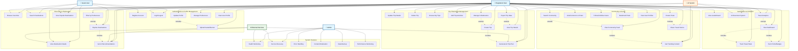

# GlobeLoom - Simplified Use Case Diagram for Mermaid

Copy and paste this code directly into Mermaid tools like mermaid.live or mermaid.js.org:

```mermaid
flowchart TB
    %% Actors
    Guest[👤 Guest User]
    User[👤 Registered User]
    Admin[👤 Admin]
    AI[🤖 AI System]
    External[🌐 External Services]
    
    %% Use Cases - Authentication & Profile
    subgraph AuthProfile ["Authentication & Profile Management"]
        UC1[Register Account]
        UC2[Login/Logout]
        UC3[Update Profile]
        UC4[Upload Avatar/Banner]
        UC5[Manage Preferences]
        UC6[View User Profile]
    end
    
    %% Use Cases - Trip Management
    subgraph TripMgmt ["Trip Planning & Management"]
        UC7[Create Trip]
        UC8[Update Trip Details]
        UC9[Delete Trip]
        UC10[View Trip Details]
        UC11[Browse My Trips]
        UC12[Add Trip Activities]
        UC13[Manage Collaborators]
        UC14[Generate AI Trip Plan]
        UC15[Export Trip Data]
    end
    
    %% Use Cases - Discovery & Exploration
    subgraph Discovery ["Discovery & Exploration"]
        UC16[Explore Destinations]
        UC17[Browse Countries]
        UC18[View Destination Details]
        UC19[Search Destinations]
        UC20[Filter by Preferences]
        UC21[Get AI Recommendations]
        UC22[View Popular Destinations]
    end
    
    %% Use Cases - Community Features
    subgraph Community ["Community & Social"]
        UC23[Create Posts]
        UC24[View Community Feed]
        UC25[Like/Comment on Posts]
        UC26[Share Travel Stories]
        UC27[Follow/Unfollow Users]
        UC28[Bookmark Posts]
        UC29[View User Profiles]
        UC30[Search Community]
        UC31[Get Trending Content]
    end
    
    %% Use Cases - Gamification & Analytics
    subgraph Gamification ["Gamification & Analytics"]
        UC32[View Dashboard]
        UC33[Track Travel Stats]
        UC34[Earn Points/Badges]
        UC35[View Leaderboard]
        UC36[Achievement System]
        UC37[Travel Analytics]
    end
    
    %% Use Cases - System Features
    subgraph SystemFeatures ["System Features"]
        UC38[Health Monitoring]
        UC39[Service Discovery]
        UC40[Error Handling]
        UC41[Content Moderation]
        UC42[Data Backup]
        UC43[Performance Monitoring]
    end
    
    %% Guest User Relationships
    Guest --> UC1
    Guest --> UC2
    Guest --> UC16
    Guest --> UC17
    Guest --> UC18
    Guest --> UC19
    Guest --> UC22
    
    %% Registered User Relationships
    User --> UC2
    User --> UC3
    User --> UC4
    User --> UC5
    User --> UC6
    User --> UC7
    User --> UC8
    User --> UC9
    User --> UC10
    User --> UC11
    User --> UC12
    User --> UC13
    User --> UC14
    User --> UC15
    User --> UC16
    User --> UC17
    User --> UC18
    User --> UC19
    User --> UC20
    User --> UC21
    User --> UC22
    User --> UC23
    User --> UC24
    User --> UC25
    User --> UC26
    User --> UC27
    User --> UC28
    User --> UC29
    User --> UC30
    User --> UC31
    User --> UC32
    User --> UC33
    User --> UC34
    User --> UC35
    User --> UC36
    User --> UC37
    
    %% Admin Relationships
    Admin --> UC38
    Admin --> UC39
    Admin --> UC40
    Admin --> UC41
    Admin --> UC42
    Admin --> UC43
    
    %% AI System Relationships
    AI --> UC14
    AI --> UC21
    AI --> UC31
    AI --> UC36
    AI --> UC37
    
    %% External Services Relationships
    External --> UC14
    External --> UC18
    External --> UC21
    External --> UC38
    External --> UC39
    
    %% Include Relationships (dotted lines with labels)
    UC7 -.->|includes| UC14
    UC16 -.->|includes| UC21
    UC24 -.->|includes| UC31
    UC32 -.->|includes| UC33
    UC32 -.->|includes| UC34
    UC3 -.->|includes| UC4
    UC23 -.->|includes| UC26
    
    %% Extend Relationships (dotted lines with labels)
    UC15 -.->|extends| UC10
    UC13 -.->|extends| UC7
    UC20 -.->|extends| UC16
    UC30 -.->|extends| UC24
    UC37 -.->|extends| UC32
    
    %% Styling
    classDef actor fill:#e1f5fe,stroke:#01579b,stroke-width:2px,color:#000
    classDef usecase fill:#f3e5f5,stroke:#4a148c,stroke-width:2px,color:#000
    classDef ai fill:#fff3e0,stroke:#e65100,stroke-width:2px,color:#000
    classDef external fill:#e8f5e8,stroke:#1b5e20,stroke-width:2px,color:#000
    
    class Guest,User,Admin actor
    class AI ai
    class External external
```
